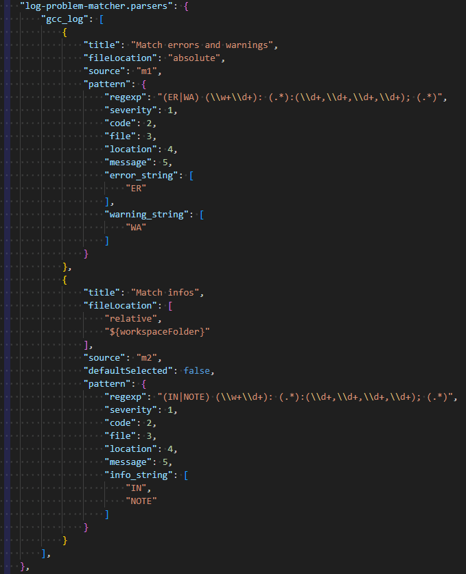

# Log Problem Matcher

Log Problem Matcher (LPM) scans a log file and outputs any errors, warnings, or infos found to the VS Code Problems pane. You define a regular expression to match the issues you want to extract from the log file and tell LPM what type of data you've captured with the regex. Then LPM scans your log and populates the Problems pane. The setup for LPM is similar to the [problem matcher used in VS Code Tasks](https://code.visualstudio.com/docs/debugtest/tasks#_defining-a-problem-matcher).

You can configure multiple "parsers", each targeted at a different type of log file. Each parser can have multiple matchers in case you need multiple regular expressions to capture the different types of problems.

## Commands

- `Scan File`: Choose a parser, matcher(s), and log file to scan. This should be the first command you run. It will scan the chosen log file with the chosen matchers and add any detected problems to the VS Code's Problems pane.
   - The `Scan File` command can also be accessed by right clicking on a log file in the Explorer view and selecting `LPM: Scan for Problems`.
- `Rescan`: If you have already run a scan command, this will clear problems and re-scan the same log file with the same matcher(s).
- `Rescan with Different Parser/Matcher(s)`: Choose new parser and/or matcher(s), but use the last-selected log file.
- `Clear Problems`: Clear all LPM-generated problems from the Problems pane.

## Extension Settings

LPM contributes the following settings:

- `log-problem-matcher.parsers`: This is where you will configure all parsers and problem matchers.

The "parsers" setting is an object where the keys are the names of your different parsers. For example, you may have a parser set up for logs that come from a particular program.

Each named parser contains an array of problem matchers. These problem matchers are defined in the same way as [problem matchers for VS Code tasks](https://code.visualstudio.com/docs/debugtest/tasks#_defining-a-problem-matcher), with a couple minor differences. The biggest limitation is that LPM doesn't yet support multi-line problem matchers.

One addition to the standard problem matchers is that LPM contains three optional keys in the "pattern" which allow for more flexibility in detecting different types of problems: error_string, warning_string, and info_string. While VS Code's task problem matchers only detect the different types of problems with the default strings "error", "warning", and "info", LPM allows you to define your own indicators.

For example, if your log file indicates and error with "ER: Message", you could set the "error_string" to "ER". Then when your regex matches "ER" in the severity group, LPM will automatically detect it as an error. The custom indicator properties accept a single string or an array of strings in case your log is particularly crazy and uses multiple styles.

### Problem Matcher Properties

Parsers have the following optional properties which are different from standard task problem matchers:

- `title`: The matcher title is shown in the menu when you run a command. If you don't supply a title, the matcher will be labelled with its index in the matcher array, e.g. "Matcher 0" for the first matcher within a parser.
- `fileLocation`: This property may behave differently from task problem matchers. It can be either a string: "absolute", or an array of strings: ["relative", {relative_path}]. If your log reports absolute paths, use the former. If your log reports relative paths, use the latter and set {relative_path} to the base path that the reported paths are relative to. If not defined, paths will be assumed to be absolute.
- `source`: The source will be shown in the Problems pane to the right of the message, to indicate which matcher caught the problem. If not defined, the source will simply be "LPM". If a source is provided in the matcher, the displayed source will be "LPM-source".
- `defaultSelected`: Set this property to boolean false to make it so the matcher is unchecked by default in the quick pick menu. This will be overridden by previous selections after the first time a command is run. Defaults to "true" if omitted.

Problem matchers (the array elements inside a Parser) have the following optional properties which are different from standard task problem matchers:

- `error_string`: A string or array of strings showing what to match in the log to detect an error.
- `warning_string`: Same as error_string, but for warnings.
- `info_string`: Same as error_string, but for infos.

LPM does not include the following properties present in standard task problem matchers:

- `background`
- `owner`
- `applyTo`
- `base`

## Sample Configuration

The below image shows a sample configuration for a Parser. This Parser, named "gcc_log", has two matchers: one for catching errors and warnings and another for notes and infos. Note that this isn't really a valid matcher for gcc, just an example. The regular expressions in this sample might match lines that look like this:

- `ER CODE42: /path/to/source_file.c:10,0,10,4; Sample message`
- `IN CODE50: /path/to/source_file.c:10,0,10,4; Sample message`

## Known Issues

- LPM doesn't yet support multi-line problem matchers as are present in VS Code tasks.

## Release Notes

### 1.0.0

Initial release.
